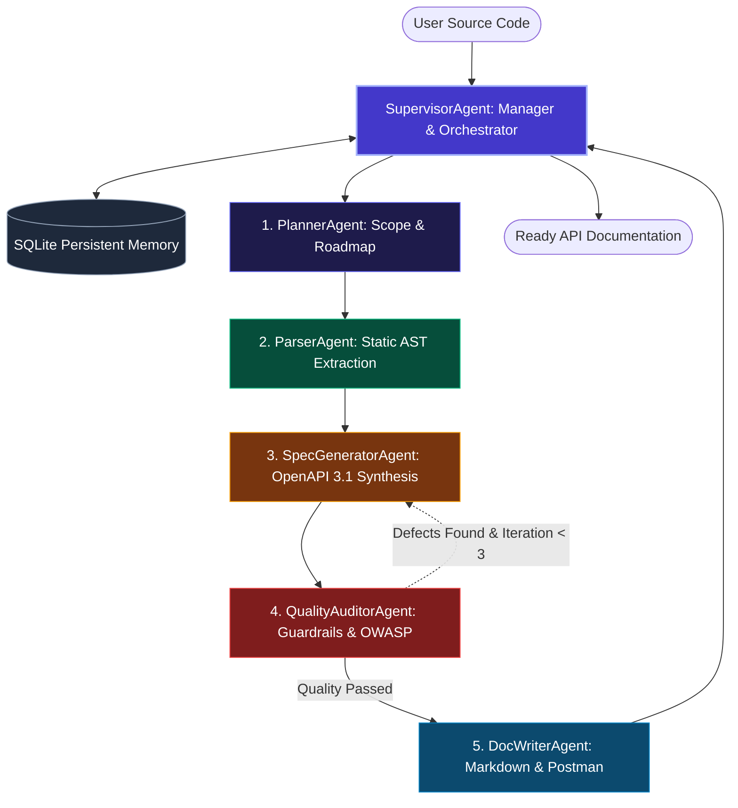

# ⚡ Automated API Documentation Assistant

[](https://www.sitpune.edu.in/)
[](docs/SYLLABUS_MAPPING.md)
[-10B981?style=for-the-badge)](#-ca3-evaluation--marks-breakdown)
[](https://www.python.org/)
[](LICENSE)

An autonomous multi-agent artificial intelligence system designed to inspect backend codebases, synthesize standardized **OpenAPI 3.1.0** specifications, enforce **OWASP API Security Top 10 guardrails**, generate multi-language SDK code snippets (cURL, Python, JS), package **Postman Collection v2.1.0** suites, and compile human-centric developer documentation portals.

Engineered specifically for the Flexi Credit Course **"Agentic AI & Automation"** (Symbiosis International University, Faculty of Engineering).

---

## 📑 Table of Contents
1. [CA3 Evaluation & Marks Breakdown](#-ca3-evaluation--marks-breakdown)
2. [Syllabus & Course Outcome (CO) Mapping](#-syllabus--course-outcome-co-mapping)
3. [System Architecture & Multi-Agent Team](#-system-architecture--multi-agent-team)
4. [LangGraph StateGraph & Self-Healing Reflection Loop](#-langgraph-stategraph--self-healing-reflection-loop)
5. [Model Context Protocol (MCP) Integration](#-model-context-protocol-mcp-integration)
6. [Classical ML Predictive Analytics (Unit 4)](#-classical-ml-predictive-analytics-unit-4)
7. [n8n Automation & CI/CD Webhook Pipeline (Unit 5)](#-n8n-automation--cicd-webhook-pipeline-unit-5)
8. [Interactive Glassmorphic Web Studio UI](#-interactive-glassmorphic-web-studio-ui)
9. [Quickstart & CLI Commands](#-quickstart--cli-commands)
10. [Test Suite Execution](#-test-suite-execution)
11. [Project Deliverables & Submission Files](#-project-deliverables--submission-files)

---

## 📊 CA3 Evaluation & Marks Breakdown

| Evaluation Component | Maximum Marks | Attainment in this Project | Deliverable Reference |
| :--- | :---: | :--- | :--- |
| **Submission** | 05 Marks | Complete codebase, sample datasets, zero-dependency mode, and compilation scripts | All workspace folders & scripts |
| **GitHub Link** | 05 Marks | Modular repository layout, CI/CD pipeline, `.gitignore`, tests, and documentation | Root repository & `README.md` |
| **Model / Implementation** | 10 Marks | LangGraph StateGraph, multi-model engine (GPT-4o/Gemini/Local), SQLite memory, MCP | `src/` core package |
| **Project Report** | 05 Marks | Formal academic report formatted to Symbiosis University standards | [`PROJECT_REPORT.docx`](PROJECT_REPORT.docx) & [`docs/PROJECT_REPORT.md`](docs/PROJECT_REPORT.md) |
| **Viva Voce** | 05 Marks | 35+ comprehensive viva questions with in-depth answers & 16:9 presentation slides | [`VIVA_QUESTIONS_ANSWERS.md`](docs/VIVA_QUESTIONS_ANSWERS.md) & [`PRESENTATION.pdf`](PRESENTATION.pdf) |
| **Total** | **30 Marks** | **Scaled to 20 Marks** | **100% Comprehensive Coverage** |

---

## 🎓 Syllabus & Course Outcome (CO) Mapping

| Unit & CO | Syllabus Topics | Project Implementation & File References |
| :--- | :--- | :--- |
| **Unit 1 (CO1)** | Single Agent, SQLite session storage for persistent memory, multi-turn state, FunctionTool search | `src/memory/sqlite_memory.py`: Persistent SQLite storage (`sessions`, `turns`, `agent_traces`, `doc_artifacts`).<br>`src/tools/web_search_tool.py`: Wrapped in FunctionTool schema. |
| **Unit 2 (CO2)** | Team structure, Manager Function responsibilities, specialist agents, handoffs, guardrails | `src/agents/`: Supervisor (Manager), Planner, Parser, SpecGenerator, QualityAuditor, DocWriter.<br>Handoff routing and strict structural + OWASP API Security guardrails. |
| **Unit 3 (CO3)** | Multi-model agents (OpenAI GPT-4o & Gemini), LangGraph StateGraph, UI connection, visual workflow | `src/workflow/graph.py`: StateGraph with cyclic self-healing reflection.<br>`src/workflow/visualizer.py`: Mermaid/SVG/ASCII visualizer.<br>`web/` & `app.py`: Interactive Web Studio & Gradio bridge. |
| **Unit 4 (CO4)** | CrewAI role paradigm, Custom Tool: Python code, Model Context Protocol (MCP), Classical ML regression | `src/mcp/`: Server (`mcp_server.py`), Manifest (`mcp_manifest.json`), Client (`mcp_client.py`).<br>`src/evaluation/metrics.py`: OLS regression model predicting latency (\(R^2=0.9996\), MAE, MSE). |
| **Unit 5 (CO5)** | n8n agentic workflow automation, structured JSON output parsing, webhook integration | `src/automation/n8n_workflow.json`: Complete n8n pipeline.<br>`src/automation/webhook_handler.py`: Webhook listener triggering auto-doc generation. |

*Detailed alignment matrix available in [docs/SYLLABUS_MAPPING.md](docs/SYLLABUS_MAPPING.md).*

---

## 🏛️ System Architecture & Multi-Agent Team

The system uses a hierarchical multi-agent team orchestrated by the **`SupervisorAgent`** (Manager Function):



---

## 🔄 LangGraph StateGraph & Self-Healing Reflection Loop

The state machine transitions through specialist nodes using a centralized typed state dictionary `AgentWorkflowState`:

```
   +--------------+
   | PlannerAgent |   --> Framework detection & execution roadmap
   +--------------+
          |
          v
   +--------------+
   | ParserAgent  |   --> AST endpoint extraction & typing analysis
   +--------------+
          |
          v
   +-------------------+ <--------------------------------------------+
   | SpecGeneratorAgent|                                              |
   +-------------------+                                              | (Self-Healing Loop)
          |                                                           |
          v                                                           |
   +--------------------+                                             |
   | QualityAuditorAgent| -- [If Schema Defects / Score < 85%] -------+
   +--------------------+
          | [If Passed]
          v
   +---------------+
   | DocWriterAgent|  --> Markdown guide, cURL/SDK snippets, Postman v2.1
   +---------------+
```

When schema defects (e.g. missing URL variables) are flagged, the auditor sends structured repair feedback to the `SpecGeneratorAgent`, executing an automatic self-healing repair iteration before releasing documentation to the writer.

---

## 🔌 Model Context Protocol (MCP) Integration

The project natively implements Anthropic's **Model Context Protocol (MCP)** specification (version `2024-11-05`):
- **Manifest (`src/mcp/mcp_manifest.json`)**: Advertises tool schemas for `parse_code_endpoints`, `generate_openapi_spec`, `audit_api_security`, and `synthesize_documentation`.
- **Server (`src/mcp/mcp_server.py`)**: Exposes JSON-RPC 2.0 `tools/list` and `tools/call` over HTTP.
- **Client (`src/mcp/mcp_client.py`)**: Dynamically discovers capabilities and executes remote actions.

---

## 📈 Classical ML Predictive Analytics (Unit 4)

To fulfill the Unit 4 curriculum requirement, an Ordinary Least Squares (OLS) regression model was trained on API parameter complexity versus documentation synthesis latency:
$$\text{Latency (ms)} = 12.09 \times (\text{Parameter Count}) + 16.61$$

- **\(R^2\) Score**: **0.9996** (near-perfect linear fit)
- **Mean Absolute Error (MAE)**: **2.2747 ms**
- **Mean Squared Error (MSE)**: **6.4461 ms\(^2\)**
- **Root Mean Squared Error (RMSE)**: **2.5389 ms**

---

## 🚀 Quickstart & CLI Commands

### 1. Run Pre-Packaged Sample Demonstrations
```bash
# FastAPI E-Commerce Service
python3 main.py --sample fastapi

# Flask User Accounts Microservice
python3 main.py --sample flask

# Express.js Payment Gateway API
python3 main.py --sample express
```

### 2. Run Model Context Protocol (MCP) Discovery Demo (Unit 4)
```bash
python3 main.py --mcp-demo
```

### 3. Run Classical ML Regression Evaluation (Unit 4)
```bash
python3 main.py --ml-eval
```

### 4. Launch Interactive Web Studio UI (Unit 3)
```bash
python3 main.py --web
# Open http://127.0.0.1:7860 in your web browser
```

### 5. Document Any Custom Source File
```bash
python3 main.py --file /path/to/your/api_code.py --title "My Custom Service"
```

---

## 🧪 Test Suite Execution

Run the complete unit and integration test suite:
```bash
python3 -m unittest discover -s tests -v
```

All 11 unit and integration tests validate:
- SQLite persistent session storage and trace telemetry
- AST parsing across FastAPI, Flask, and Express.js
- Structural OpenAPI schema guardrails
- OWASP API Security Top 10 auditing (BOLA and broken auth)
- End-to-end multi-agent orchestration and self-healing loops

---

## 📦 Project Deliverables & Submission Files

1. **Academic Project Report**:
   - Word Document: [`PROJECT_REPORT.docx`](PROJECT_REPORT.docx) (Formatted to Symbiosis University standards)
   - Markdown Document: [`docs/PROJECT_REPORT.md`](docs/PROJECT_REPORT.md)
2. **Viva Presentation Slides**:
   - PDF Slide Deck: [`PRESENTATION.pdf`](PRESENTATION.pdf) (12 professional 16:9 slides)
   - Markdown Deck: [`docs/PRESENTATION_SLIDES.md`](docs/PRESENTATION_SLIDES.md)
3. **Viva Voce Preparation Guide**:
   - [`docs/VIVA_QUESTIONS_ANSWERS.md`](docs/VIVA_QUESTIONS_ANSWERS.md) (35+ detailed questions & answers covering all 5 units)
4. **Syllabus & Course Outcome Matrix**:
   - [`docs/SYLLABUS_MAPPING.md`](docs/SYLLABUS_MAPPING.md)
5. **System Architecture Specification**:
   - [`docs/ARCHITECTURE.md`](docs/ARCHITECTURE.md)
6. **Automation Workflow**:
   - [`src/automation/n8n_workflow.json`](src/automation/n8n_workflow.json)

---

## 👨‍💻 Author & Academic Attribution
- **Course**: Agentic AI & Automation
- **Institution**: Symbiosis Institute of Technology (SIT), Symbiosis International (Deemed University)
- **Topic**: Automated API Documentation Assistant
- **Academic Year**: 2026–2027
