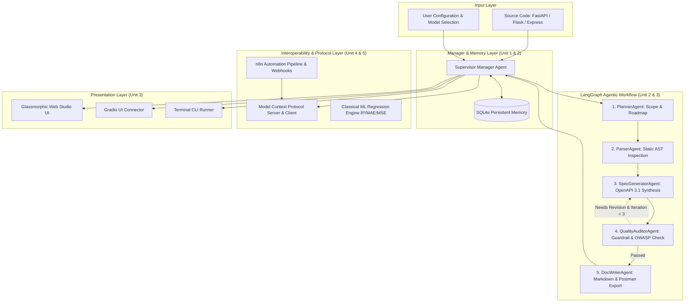

# System Architecture & Technical Specification

## 1. Architectural Overview

The **Automated API Documentation Assistant** is an agentic artificial intelligence system designed to autonomously inspect backend source code, generate compliant OpenAPI 3.1.0 specifications, conduct OWASP API Security Top 10 audits, synthesize multi-language SDK code snippets, and compile developer portal documentation.



---

## 2. Multi-Agent Team Structure & Responsibilities

| Agent Name | Role Designation | Primary Responsibility | Associated Tools |
| :--- | :--- | :--- | :--- |
| **`SupervisorAgent`** | Engineering Manager & Orchestrator | Triages user requests, initializes sessions in SQLite, coordinates linear and conditional handoffs, validates sign-offs. | `SQLiteAgentMemory` |
| **`PlannerAgent`** | API Documentation Strategist | Scans repository layout, detects framework patterns, computes candidate endpoints, formulates execution plan. | `ASTParserTool` |
| **`ParserAgent`** | AST & Code Inspection Specialist | Decomposes function AST nodes, parses decorators, extracts parameters, typing hints, Pydantic schemas, and auth hooks. | `ASTParserTool` |
| **`SpecGeneratorAgent`**| OpenAPI 3.1 Standards Engineer | Synthesizes OpenAPI 3.1.0 data dictionaries, operations, schemas, components, and securitySchemes. Applies self-healing fixes. | Schema Builder |
| **`QualityAuditorAgent`**| Security & Guardrail Auditor | Validates OpenAPI syntax rules and audits endpoints against OWASP API Security Top 10 vulnerabilities (BOLA, Broken Auth, DoS). | `OpenAPIValidatorTool`, `SecurityAuditorTool` |
| **`DocWriterAgent`** | Technical Documentation Author | Crafts publication-grade Markdown documentation, cURL/Python/JS code samples, and Postman Collection v2.1.0 JSON. | `CurlGeneratorTool` |

---

## 3. LangGraph State Machine Specification

The state machine maintains a typed dictionary `AgentWorkflowState`:

```python
class AgentWorkflowState(TypedDict):
    session_id: str
    input_code: str
    framework: str
    api_title: str
    api_version: str
    plan: Dict[str, Any]
    endpoints: List[Dict[str, Any]]
    openapi_spec: Dict[str, Any]
    audit_report: Dict[str, Any]
    audit_feedback: List[str]
    needs_revision: bool
    iteration_count: int
    documentation_markdown: str
    postman_collection: Dict[str, Any]
    execution_log: List[Dict[str, Any]]
    total_execution_time_ms: float
```

### Self-Healing Guardrail Cycle:
```
[SpecGeneratorAgent] --> [QualityAuditorAgent]
       ^                           |
       |                           | If errors detected and iteration < MAX_ITERATIONS
       +--- (Cyclic Reflection) ---+
                                   | If valid and score >= threshold
                                   v
                          [DocWriterAgent]
```

---

## 4. Model Context Protocol (MCP) Architecture

The project implements the official **Model Context Protocol (MCP)** specification (JSON-RPC 2.0):
1. **Manifest (`mcp_manifest.json`)**: Formally advertises tool schemas, input constraints, and descriptions to connected LLMs or external orchestrators.
2. **Server (`mcp_server.py`)**: Listens on HTTP/JSON-RPC, responding to `tools/list` and `tools/call`.
3. **Client (`mcp_client.py`)**: Dynamically discovers available tools from the manifest and executes tasks remotely.

---

## 5. Persistent Session Schema (SQLite)

- `sessions`: Tracks session metadata, frameworks, creation timestamps, and active configurations.
- `turns`: Stores multi-turn user queries and intermediate agent state snapshots.
- `agent_traces`: Records granular execution telemetry (agent name, action, thought, execution duration in milliseconds, inputs/outputs).
- `doc_artifacts`: Stores versioned snapshots of generated outputs (`openapi_json`, `markdown_doc`, `postman_json`, `security_report`).
